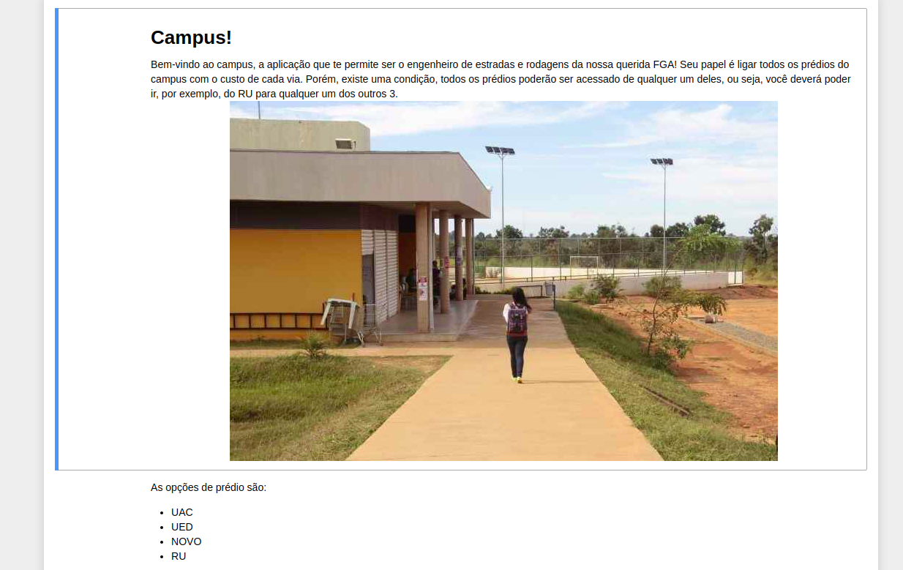
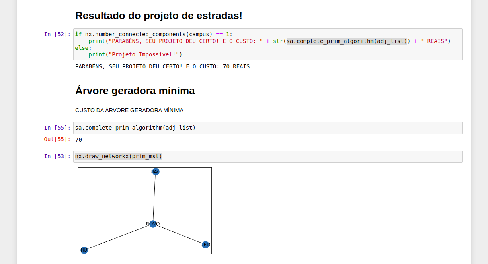

# Campus

**Número da Lista**: 2<br>
**Conteúdo da Disciplina**: Grafos 2<br>

## Alunos
|Matrícula | Aluno |
| -- | -- |
| 17/0138798  |  Caio Fernandes |
| 17/0050939  |  Lucas Dutra |

## Sobre 
A aplicação te permite ser o engenheiro de estradas e rodagens da nossa querida FGA! Seu papel é ligar todos os prédios do campus com o custo de cada via. Porém, existe uma condição, todos os prédios poderão ser acessado de qualquer um deles, ou seja, você deverá poder ir, por exemplo, do RU para qualquer um dos outros 3.

## Screenshots
### Apresentação do app

### Input de valores

### Árvore geradora mínima


## Instalação 
**Linguagem**: Python<br>
É necessário a instalação dos seguintes pacotes: **Python**, **pip** e **virtualenv** (opcional) para instalação do projeto.
### Instalação dos recursos necessários
1. Instalação do gerenciador de pacote `python pip`<br>
    ```$ sudo apt-get install python3-pip```
2. Instalação do `python virtual environment`<br>
    ```$ sudo apt-get install python3-venv```

### Criação do virtualenv (altamente recomendado)
1. Crie seu ambiente virtual python  
    ```$ python3 -m venv venv ```  
2. Execute o ambiente virtual criado  
    ```$ source venv/bin/activate```  
3. Para desativar o ambiente virtual após execução do projeto   
    ```$ deactivate```
### Execução do projeto
1. Instale as biblioteca necessárias  
    ```$ pip3 install -r requirements.txt```
2. Execute o script de pré-processamento dos dados  
    ```$ python main.py run```
3. Execute o jupyter notebook  
    ```$ jupyter-notebook --NotebookApp.token=""```
4. O navegador irá abrir na home do notebook
5. Clique no arquivo _Campus.ipynb_
6. Clique na aba Cell
7. Clique em _Run All_

## Uso 
É necessário inserir o prédio de origem, destino e o custo da estrada entre eles. Após isso, caso as condições sejam cumpridas, é retornada a árvore geradora mínima e o valor mínimo a ser gasto para construção das estradas.

## Outros 
O trabalho foi inspirado na questão [2550](https://www.urionlinejudge.com.br/judge/pt/problems/view/2550) do URI online judge.


